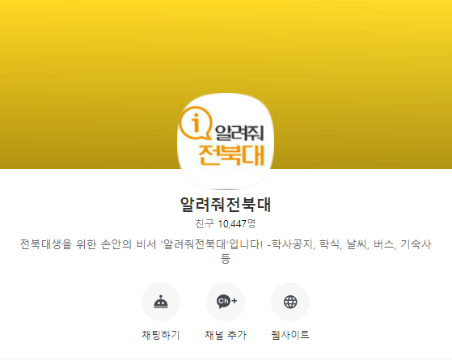

# 알려줘전북대

전북대학교 학생들을 위한 편의 기능들을 제공하는 챗봇 프로젝트입니다.  
학사공지, 학식, 날씨, 버스, 기숙사 등의 기능을 제공합니다.

## Usage

[카카오톡채널 - 알려줘전북대](http://pf.kakao.com/_LffxoM)  
위 링크를 통해 친구 추가하거나  
카카오톡 검색에서 **알려줘전북대**를 검색하여 친구 추가 후 사용 가능합니다.

채팅내에서의 사용방법은 [알려줘전북대 사용방법](http://pf.kakao.com/_LffxoM/1738089)을 참고해주세요.

## Screenshot (준비중입니다.)

## Project List

알려줘전북대는 다음과 같은 repo들로 관리되고 있습니다.  
모든 앱은 docker로 관리합니다.

- [LetMeKnow.jbnu--core](https://github.com/hmu332233/LetMeKnow.jbnu--core)
  - 알려줘전북대 메인 서버
  - 주요 기술 스텍: RubyOnRails

- [LetMeKnow.jbnu--management](LetMeKnow.jbnu--management)
  - 알려줘전북대 관리자 페이지, api 서버
  - 주요 기술 스텍: react, nodejs
  - 

- [LetMeKnow.jbnu--proxy](https://github.com/hmu332233/LetMeKnow.jbnu--proxy) (개발 중)
  - 알려줘전북대 proxy 서버
  - 주요 기술 스텍: nodejs

- [LetMeKnow.jbnu--lambda](https://github.com/hmu332233/LetMeKnow.jbnu--lambda)
  - 알려줘전북대에서 돌아가는 lambda 코드 모음

- [LetMeKnow.jbnu--bixby](LetMeKnow.jbnu--bixby) (개발 중?)
  - 알려줘전북대 빅스비 client
  - 주요 기술 스텍
    - 빅스비(?)

## Infra Structure

- [blog.minung.dev/2019-07-22/알려줘전북대-구조](https://blog.minung.dev/2019-07-22/%EC%95%8C%EB%A0%A4%EC%A4%98%EC%A0%84%EB%B6%81%EB%8C%80-%EA%B5%AC%EC%A1%B0)
  - 2019-07-22 기준 인프라 구조를 설명해둔 글입니다.
  - proxy 도입 후 변경 예정입니다.

## Contribution

- 누구든지 이 프로젝트에 참여할 수 있습니다.
- 질문 및 기능 요청 및 버그 제보는 모두 [LetMeKnow.jbnu/issues](https://github.com/hmu332233/LetMeKnow.jbnu/issues)에 남겨주세요.
- 새로운 로고를 제작해주실 분도 환영합니다!

## Contributors

지금까지 알려줘전북대에 기여해주신 분들입니다.

<!-- prettier-ignore -->
<table>
  <tr>
    <td align="center"><a href="https://github.com/hmu332233"> <b>minungHan (Me)</b></a></td>
    <td align="center"><a href="https://github.com/fdsfdsg"> <b>SangBeom Park</b></a> </td>
  </tr>
</table>